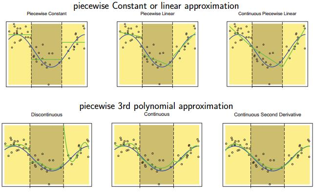

<style type="text/css">
	#header {
	    text-align: center;
	}
</style>
```{r, include=FALSE}
options(tinytex.verbose = TRUE)
```

```{r setup, include=FALSE}
knitr::opts_chunk$set(echo = TRUE)
```
<font size=4 face="微软雅黑">

#1. 研究背景以及动机
	在统计学科中，回归函数一直占有很大的地位。而线性回归则是整个回归理论的基础。在满足给定的一系列假设的前提下，通过统计回归理论可以得到对于数据的回归方程。但是由于现实中给定的一系列假设未必能够成立，需要我们通过一系列的变形来更好的拟合相应的数据结构。其中，针对违背线性假设的情况，本文给出了如样条模型、多项式模型、可加性模型以及它们的组合的一系列的解决办法。

#2. 理论模型
##2.1 样条模型（spline model）
  针对于违背线性假设的情况，我们引入样条模型.<br>
	考虑一个带有预测因子x的回归模型：分段线性模型（或者称分段回归模型）可以如下所示：
$$Y=\beta_{0}+\beta_{1} \mathbf{x}+\beta_{2}(\mathbf{x}-a)_{+}+\beta_{3}(\mathbf{x}-b)_{+}+\beta_{4}(\mathbf{x}-c)_{+}+\varepsilon$$
对应超平面的回归方程可以记为：
$$f(x)=\beta_{0}+\beta_{1} x+\beta_{2}(x-a)_{+}+\beta_{3}(x-b)_{+}+\beta_{4}(x-c)_{+}$$
其中，$$(u)_{+}=\left\{\begin{array}{l}{u, \text { if } u>0} \\ {0, \text { if } u \leq 0}\end{array}\right.$$,且a，b，c 称为结点。下面是一个例子，其中a=2，b=5，c=8<br>
<br>
<div align=center>

<br>
<font size=2>
figure1 样条模型
</font>
</div>

##2.2. 多项式模型
###2.2.1 理论模型
另一种可以解决违背线性假设情况的数据结构的拟合问题的回归模型变形是多项式回归模型。传统的多项式回归模型是利用泰勒展开式得到的多次项式去逐渐逼近数据的回归曲线。对于任意变量的k阶多项式可以记做：$$y=\beta_{0}+\beta_{1} \mathbf{x}+\beta_{2} \mathbf{x}^{2}+\ldots+\beta_{k} \mathbf{x}^{k}+\varepsilon$$
但是，这两个模型的形势仍然存在着拟合效率低的问题[1]。为了解决这类问题，本文使用了多项式样条回归模型，将这两类结合使用。<br>
由于我们对于给定x的情况下y的条件期望感兴趣（当x是单一变量的时候），其模型可以记为：
$$Y=m(\mathbf{x})+\varepsilon$$
通过泰勒展开式，当k足够大时我们可以用如下k阶多项式去逼近m(x)：
$$P(x)=a_{0}+a_{1} x+\ldots+a_{k} x^{k}$$
多项式样条模型可以逼近各种分段函数，用t1,…,tj，一系列固定点将x的区域划分为几个子区间，具体为：$-\infty<t_{1}<t_{2}<\ldots<t_{J}<\infty$,其中，我们称$\left\{t_{j}, j=1,2, \ldots, J\right\}$为结点，J为节点数。在每个区间中，使用多项式逼近真函数且在区间的末端，函数是光滑的(即存在K阶导数)，通常使用3阶多项式即可满足大多数需求。对于三次样条函数要求其是连续两次可微的，并且在每个区间内是3阶多项式。<br>
所有三次样条函数的集合形成线性空间。有两个流行的三次样条基函数：$$\begin{array}{c}{1, x, x^{2}, x^{3},\left(x-t_{j}\right)_{+}^{3},(j=1, \ldots, J), \text { where }} \\ {\left(x-t_{j}\right)_{+}^{3}=\left\{\begin{array}{ll}{\left(x-t_{j}\right)^{3},} & {\text { if } x-t_{j} \geq 0} \\ {0,} & {\text { otherwise }}\end{array}\right.}\end{array}$$其中基函数定义为：$B_{1}(x)=1, \quad B_{2}(x)=x, \quad B_{3}(x)=x^{2}, \quad B_{4}(x)=x^{3}, \quad B_{4+j}(x)=\left(x-t_{j}\right)_{+}^{3}$具有j个结点的三次样条函数如下：
$$f(x)=\sum_{k=1}^{J+4} \theta_{k} B_{k}(x)$$

###2.2.2. 模型参数估计
三次样条函数可以表示为：$s(x)=\sum_{j=1}^{J+4} \theta_{j} B_{j}(x)$。其中$B_{1}(x), B_{2}(x), \ldots, B_{J+4}(x)$为基函数。可以证明，对于在[a,b]区间上具有连续导数的任意函数m(X)，如果结点$t_{j+1}-t_{j} \rightarrow 0$,我们可以近似得到$s(x) \rightarrow m(x)$<br>近似如下，蓝色是真实函数m(X)，绿色是近似曲线。通过James（2017）等学者的研究，有：
<br>
<font size=2>
<div align=center>

</div>
figure2中首先图中上图是利用线性回归模型求其回归曲线。左1对于3个区间求得均值，左二图中对于不同区间分别运用最小二乘求得其回归曲线，左3则增加了连续的要求限制，则曲线有了连续的性质。
对于下图，则运用了多项式样条回归模型。左1对于3个区间分别求得其回归曲线，左则增加了连续的要求限制，则曲线有了连续的性质。图三增加了光滑的约束，则我们得到最终的拟合曲线。
</font>
<br>为了简化统计理论，我们研究了一个三次样条模型。
$$Y=\sum_{j=1}^{J+4} \theta_{j} B_{j}(X)+\varepsilon$$
最小二乘估计是最小化$\min _{\theta_{1}, \ldots, \theta_{J+4}} \sum_{i=1}^{n}\left\{Y_{i}-\sum_{j=1}^{J+4} \theta_{j} B_{j}\left(X_{i}\right)\right\}^{2}$
使得对于$\mathbb{Y}=\left(\begin{array}{c}{Y_{1}} \\ {Y_{2}} \\ {\ldots} \\ {Y_{n}}\end{array}\right)$,$\mathbb{X}=\left(\begin{array}{cccc}{B_{1}\left(X_{1}\right)} & {B_{2}\left(X_{1}\right)} & {\dots} & {B_{J+4}\left(X_{1}\right)} \\ {B_{1}\left(X_{2}\right)} & {B_{2}\left(X_{2}\right)} & {\dots} & {B_{J+4}\left(X_{2}\right)} \\ {\cdots} & {} & {} & {} \\ {B_{1}\left(X_{n}\right)} & {B_{2}\left(X_{n}\right)} & {\dots} & {B_{J+4}\left(X_{n}\right)}\end{array}\right)$,$\theta=\left(\begin{array}{c}{\theta_{1}} \\ {\theta_{2}} \\ {\dots} \\ {\theta_{J+4}}\end{array}\right)$,即可得：$\hat{\theta}=\left(\mathbb{X}^{\top} \mathbb{X}\right)^{-1} \mathbb{X}^{\top} \mathbb{Y}$,并且估计方程为：$\hat{m}(x)=\left(B_{1}(x), \ldots, B_{J+4}(x)\right) \hat{\theta}=\sum_{j=1}^{J+4} \hat{\theta}_{j} B_{j}(x)$。<br>

###2.2.3. 数值模拟实验
 \quad\quad 假设模型为：$Y=\sin (2 \pi \mathbf{x})+0.2 \varepsilon$，其中$\mathbf{x} \sim U n i f o r m(0,1) \quad \varepsilon \sim N(0,1)$, 且相互独立。对于模型$m(x)=\sin (2 \pi x)$,我们模拟了40个观测样本，运用不同的结点k=3,6,12,20.估计方程如下图3:
```{r}
 ####pringt figure 2
pspline<-function(x, y, xnew=x, knots=5)
{
  n = length(y)
  
  orderx = order(x)
  J = x[orderx]
  K = floor(n/knots);
  K = (1:(knots-1))*K
  knotsp = J[K];
  J = length(knotsp)
  X = matrix(1, n, J+4)
  X[,2] = x
  X[,3] = x^2
  X[,4] = x^3
  
  ne = length(xnew)
  Xe = matrix(1, ne, J+4)
  Xe[,2] = xnew
  Xe[,3] = xnew^2
  Xe[,4] = xnew^3
  
  for (j in 1:J)
  {
    X[,4+j] = (x-knotsp[j])^3*(x-knotsp[j]>0)
    Xe[,4+j] = (xnew-knotsp[j])^3*(xnew-knotsp[j]>0)
  }
  
  invXX = solve(t(X) %*% X + diag(c(matrix(1, J+4, 1)))/n^2)
  theta = invXX %*% (t(X) %*% y)
  
  s2 = mean((y - X%*% theta)^2)
  
  W = sqrt(diag(Xe %*% (invXX*s2) %*% t(Xe)))
  
  m = Xe %*% theta
  
  
  return(list(m=m, Un = m+1.96*W, Ln = m-1.96*W))
}

n=40
 x = runif(n)
 y = sin(2*pi*x) + 0.2*rnorm(n)

 xe = min(x) + (max(x) - min(x))*(0:10)/10


 out3 = pspline(x, y, xnew=xe, knots=3)

 out8 = pspline(x, y, xnew=xe, knots=6)
 
 out15 = pspline(x, y, xnew=xe, knots=12)

 out25 = pspline(x, y, xnew=xe, knots=20)

par(mfrow=c(2,2))

plot(x,y, main="no. of knots = 3")
lines(xe, out3$m)

plot(x,y, main="no. of knots = 6")
lines(xe, out8$m)


plot(x,y, main="no. of knots = 12")
lines(xe, out15$m)

plot(x,y, main="no. of knots = 20")
lines(xe, out25$m)


```
<br>
<div align=center>
<font size=2>
figure3可以看出当$k>3$的时候整个模型效果都比较好
</font>
<br>
</div>
接下来我们会对比使用logistics模型与多项式模型的结果比较，我们采用RMSE来进行比较，其表达式为：$rMSE=\frac{1}{n} \sum_{i=1}^{n}\left(y_{i}-\hat{y}_{i}\right)^{2}$,结果如下 
```{r}
# require(pspline)
#请先运行上面的pspline function
n=40
x = runif(n)
y = sin(2*pi*x) + 0.2*rnorm(n)

xe = min(x) + (max(x) - min(x))*(0:10)/10

out3 = pspline(x, y, xnew=x, knots=3)
ans3 = mean((y - out3$m)^2) 

out8 = pspline(x, y, xnew=x, knots=6)
ans8 = mean((y - out8$m)^2) 

out15 = pspline(x, y, xnew=x, knots=12)
ans15 = mean((y - out15$m)^2) 

out25 = pspline(x, y, xnew=x, knots=20)
ans25 = mean((y - out25$m)^2)

glm = glm(y~x)
ansglm = mean((y - predict(glm))^2)

ans = data.frame(Knot=c(0, 3, 8, 15, 25), rMSE = c(ansglm, ans3, ans8, ans15, ans25))
ans
```
<font size=2>
<div align=center>
表1 模拟结果：rMSE<br>
注：表1中，Knot=0表示logistics model
</font>
</div>
 <br> 


##2.3 可加性模型
假设我们有因变量y和多个预测因子（独立变量）X1,…,Xp，我们想知道：
$m\left(x_{1}, \ldots, x_{p}\right)=E\left(Y | \mathbf{x}_{1}=x_{1}, \ldots, \mathbf{x}_{p}=x_{p}\right)$
对于任意的X，我们需要估计m。但是实际中，尤其是大数据背景下，我们常常会遇到维数灾难的问题。所以我们引入可加性模型（Additive model）在一些情况下来拟合我们的数据。<br>
可加性模型是一种通过近似逼近M(.)的一种方式，是每个变量的函数的和。$$m\left(x_{1}, \ldots, x_{p}\right) \approx g_{1}\left(x_{1}\right)+\ldots .+g_{p}\left(x_{p}\right)$$如果上式成立，我们可以得到可加性模型：$$Y=g_{1}\left(\mathbf{x}_{1}\right)+\ldots .+g_{p}\left(\mathbf{x}_{p}\right)+\varepsilon$$其中$E\left(\varepsilon | \mathbf{x}_{1}=x_{1}, \ldots, \mathbf{x}_{p}=x_{p}\right)=0$.<br>
我们假设可加性模型为如下结构：$$Y=f_{1}\left(\mathbf{x}_{1}\right)+\ldots .+f_{p}\left(\mathbf{x}_{p}\right)+\varepsilon$$
其中F()为非参数变量形势，具体如下：$$f_{k}\left(\mathbf{x}_{k}\right)=c_{k}+g_{k}\left(\mathbf{x}_{k}\right)$$$C_{k}$是常数，故我们也可以将上式写成：$$Y=\beta_{0}+g_{1}\left(\mathbf{x}_{1}\right)+\ldots .+g_{p}\left(\mathbf{x}_{p}\right)+\varepsilon$$其中$E\left\{g_{k}\left(\mathbf{x}_{k}\right)\right\}=0, k=1, \ldots, p$。

##2.4 线性可加模型
###2.4.1 模型结构
大多数时候，我们都知道y和一些独立的自变量之间的关系。我们也可以在可加模型中运用这些信息来提高我们模型的拟合效果。比如，如果我们知道了自变量Y与因变量X存在一定的线性关系，我们可以运用分段线性可加模型（partially linear additive model），如下：$$Y=\beta_{0}+\beta_{1} \mathbf{x}_{1}+\ldots+\beta_{q} \mathbf{x}_{q}+g_{q+1}\left(\mathbf{x}_{q+1}\right)+\ldots+g_{p}\left(\mathbf{x}_{p}\right)+\varepsilon$$其中$E\left\{g_{k}\left(\mathbf{x}_{k}\right)\right\}=0，K=q+1,…,p, g_{q+1}\left(\mathbf{x}_{q+1}\right), \ldots, g_{p}\left(\mathbf{x}_{p}\right) 是非参数部分$。$\operatorname{Var}(\varepsilon)=\sigma^{2}$

##2.4.2 模型参数估计
估计部分线性加性模型的一种方法是假定非线性分量具有样条形式，比如：$$g_{k}(x)=\sum_{j=1}^{J_{k}+4} \theta_{k, j} B_{k, j}(x)=\theta_{k, 1}+\sum_{j=2}^{J_{k}+4} \theta_{k, j} B_{k, j}(x)$$其中$B_{k, j}, j=1, \ldots, J_{k}+4$是g（）的样条基函数，因此该模型也可以写作：$$Y=\beta_{0}+\beta_{1} \mathbf{x}_{1}+\ldots+\beta_{q} \mathbf{x}_{q}+\sum_{j=2}^{J_{q+1}+4} \theta_{q+1, j} B_{q+1, j}\left(\mathbf{x}_{q+1}\right)+\ldots+\sum_{j=2}^{J_{p}+4} \theta_{p, j} B_{p, j}\left(\mathbf{x}_{p}\right)+\varepsilon$$
其中标准参数为$\beta_{0}, \beta_{1}, \ldots, \beta_{q}, \theta_{q+1,2}, \ldots, \theta_{q+1, J_{q+1}+4}, \ldots, \theta_{p, 2}, \ldots, \theta_{p, J_{p}+4}$<br>
接下来，我们假设$\left(\mathbf{x}_{i 1}, \ldots, \mathbf{x}_{i p}, Y_{i}\right), i=1, \dots, n$为从模型中的抽样，设其数据结构为：$$X=\left( \begin{matrix}{l}
	1&		x_{1,1}&		\cdots&		x_{1,q}&		B_{q+1,2}\left( x_{1,q+1} \right)&		\cdots&		B_{q+1,J_{q+1}+4}\left( x_{1,q+1} \right)&		\cdots&		B_{p,2}\left( x_{1,p} \right)&		\cdots&		B_{p,J_{q+1}+4}\left( x_{1,p} \right)\\
	1&		x_{2,1}&		\cdots&		x_{2,q}&		B_{q+1,2}\left( x_{2,q+1} \right)&		\cdots&		B_{q+1,J_{q+1}+4}\left( x_{2,q+1} \right)&		\cdots&		B _{p,2}\left( x_{2,p} \right)&		\cdots&		B _{p,J_{q+1}+4}\left( x_{2,p} \right)\\
	\vdots&		\vdots&		\vdots&		\vdots&		\vdots&		\vdots&		\vdots&		\vdots&		\vdots&		\vdots&		\vdots\\
	1&		x_{n,1}&		\cdots&		x_{n,q}&		B_{q+1,2}\left( x_{n,q+1} \right)&		\cdots&		B_{q+1,J_{q+1}+4}\left( x_{n,q+1} \right)&		\cdots&		B_{p,2}\left( x_{n,p} \right)&		\cdots&		B_{p,J_{ p+1}+4}\left( x_{n,p} \right)\\
\end{matrix} \right)$$
$$\beta=\left(\beta_{0}, \beta_{1}, \ldots, \beta_{q}, \theta_{q+1,2}, \ldots, \theta_{q+1, J_{q+1}+4}, \ldots, \theta_{p, 2}, \ldots, \theta_{p, J_{p}+4}\right)^{\top}$$$$\mathbb{Y}=\left(Y_{1}, Y_{2}, \ldots, Y_{n}\right)^{\top}, \quad \mathcal{E}=\left(\varepsilon_{1}, \varepsilon_{2}, \ldots, \varepsilon_{n}\right)^{\top}$$
则模型可以写作：$$\mathbb{Y}=\mathbb{X} \beta+\mathcal{E}$$

对于其最小二乘估计为：$$\left(\hat{\beta}_{0}, \hat{\beta}_{1}, \ldots, \hat{\beta}_{q}, \hat{\theta}_{q+1,2}, \ldots, \hat{\theta}_{q+1, J_{q+1}+4}, \ldots, \hat{\theta}_{p, 2}, \ldots, \hat{\theta}_{p, J_{p}+4}\right)^{\top}=\left\{\mathbb{X}^{\top} \mathbb{X}\right\}^{-1} \mathbb{X}^{\top} \mathbb{Y}$$
则对于各个非参数函数的估计为：
$$\hat{g}_{k}(x)=\sum_{j=2}^{J_{k}+4} \hat{\theta}_{k, j} B_{k, j}(x), \quad k=q+1, \ldots, p$$
并且对于方差参数的估计为：$$\hat{\sigma}^{2}=\sum_{i=1}^{n}\left(Y_{i}-\hat{Y}_{i}\right)^{2} /\left(n-p^{\prime}\right)$$

###2.4.3 数值模拟实验
给定真实模型：$$Y=\beta_{0}+\beta_{1} \mathbf{x}_{1}+\beta_{2} \mathbf{x}_{2}+g_{3}\left(\mathbf{x}_{3}\right)+g_{4}\left(\mathbf{x}_{4}\right)+\varepsilon$$
并且从中抽取100个数据,
得到估计模型以及各个参数的P值。具体过程如下：
首先我们对模型进行估计：
```{r}
xy = read.table("data03B01.dat")
 
x1 = xy[,1]
x2 = xy[,2]
x3 = xy[,3]
x4 = xy[,4]
y = xy[,5]

library('mgcv')
out = gam(y~x1+x2+s(x3)+s(x4))
out$coefficients  # output the estimated coefficients
```
接下来我们对模型做方差分析：
```{r}
anova(out)    # model testing 
```

其次我们展示了模型中非线性部分的估计：
```{r}
par(mfrow = c(1, 2))   
plot(out, se=TRUE)  # ploting the nonlinear parts
```
<div align=center>
<font size=2>
figure4 模型非线性部分的估计与置信区间
</font>
</div>
 <br> 
当然我们也可以对于test数据进行预测，过程如下
```{r}
xyNEW = read.table("data03B01p.dat")
predict.gam(out, newdata = list(x1 = xyNEW[,1], x2 = xyNEW[,2], x3 = xyNEW[,3],
                            x4 = xyNEW[,4]))

```
最后，由于模型结构是我们主观选择的，并不能保证得到最佳模型，于是我们参考AIC和CV标准对于模型进行选择，我们考虑如下模型：$$(A) : \quad Y=\beta_{0}+g_{1}\left(\mathbf{x}_{1}\right)+\beta_{2} \mathbf{x}_{2}+g_{3}\left(\mathbf{x}_{3}\right)+g_{4}\left(\mathbf{x}_{4}\right)+\varepsilon$$$$(B) : \quad Y=\beta_{0}+\beta_{1} \mathbf{x}_{1}+g_{2}\left(\mathbf{x}_{2}\right)+g_{3}\left(\mathbf{x}_{3}\right)+g_{4}\left(\mathbf{x}_{4}\right)+\varepsilon$$$$(C) : \quad Y=\beta_{0}+g_{1}\left(\mathbf{x}_{1}\right)+\beta_{2} \mathbf{x}_{2}+g_{3}\left(\mathbf{x}_{3}\right)+g_{4}\left(\mathbf{x}_{4}\right)+\varepsilon$$$$(D) : \quad Y=\beta_{0}+g_{1}\left(\mathbf{x}_{1}\right)+g_{2}\left(\mathbf{x}_{2}\right)+\beta_{3} \mathbf{x}_{3}+g_{4}\left(\mathbf{x}_{4}\right)+\varepsilon$$$$(E) : \quad Y=\beta_{0}+g_{1}\left(\mathbf{x}_{1}\right)+g_{2}\left(\mathbf{x}_{2}\right)+g_{3}\left(\mathbf{x}_{3}\right)+\beta_{4} \mathbf{x}_{4}+\varepsilon$$$$(F) : \quad Y=\beta_{0}+\beta_{1} \mathbf{x}_{1}+\beta_{2} \mathbf{x}_{2}+g_{3}\left(\mathbf{x}_{3}\right)+g_{4}\left(\mathbf{x}_{4}\right)+\varepsilon$$
相对于之前模型，6个模型的cv值分别可以通过如下方式得到：
```{r}
xy = read.table("data03B01.dat")
 
x1 = xy[,1]
x2 = xy[,2]
x3 = xy[,3]
x4 = xy[,4]
y = xy[,5]

library('mgcv')

n = length(y)

 CV0 = 0
 for (i in 1:n)
 {
   out = gam(y~ s(x1) + s(x2) + s(x3) + s(x4), subset=-i)
    yipred = predict(out, list(x1= x1[i], x2= x2[i], x3= x3[i], x4= x4[i]))
    CV0 = CV0 + (y[i]-yipred)^2
 }
 # CV0

 CV1 = 0
 for (i in 1:n)
 {
   out = gam(y~ x1 + s(x2) + s(x3) + s(x4), subset=-i)
    yipred = predict(out, list(x1= x1[i], x2= x2[i], x3= x3[i], x4= x4[i]))
    CV1 = CV1 + (y[i]-yipred)^2
 }
 # CV1

 CV2 = 0
 for (i in 1:n)
 {
   out = gam(y~ s(x1) + x2 + s(x3) + s(x4), subset=-i)
    yipred = predict(out, list(x1= x1[i], x2= x2[i], x3= x3[i], x4= x4[i]))
    CV2 = CV2 + (y[i]-yipred)^2
 }
 # CV2

 CV3 = 0
 for (i in 1:n)
 {
   out = gam(y~ s(x1) + s(x2) + x3 + s(x4), subset=-i)
    yipred = predict(out, list(x1= x1[i], x2= x2[i], x3= x3[i], x4= x4[i]))
    CV3 = CV3 + (y[i]-yipred)^2
 }
 # CV3


 CV4 = 0
 for (i in 1:n)
 {
   out = gam(y~ s(x1) + s(x2) + s(x3) + x4, subset=-i)
    yipred = predict(out, list(x1= x1[i], x2= x2[i], x3= x3[i], x4= x4[i]))
    CV4 = CV4 + (y[i]-yipred)^2
 }
 # CV4


 CV5 = 0
 for (i in 1:n)
 {
   out = gam(y~ x1 + x2 + s(x3) + s(x4), subset=-i)
    yipred = predict(out, list(x1= x1[i], x2= x2[i], x3= x3[i], x4= x4[i]))
    CV5 = CV5 + (y[i]-yipred)^2
 }
 # CV5


c(CV0, CV1, CV2, CV3, CV4, CV5)/n
```
AIC值为：
```{r}
 out0 = gam(y~ s(x1) + s(x2) + s(x3) + s(x4))
 out1 = gam(y~ x1 + s(x2) + s(x3) + s(x4))
 out2 = gam(y~ s(x1) + x2 + s(x3) + s(x4))
 out3 = gam(y~ s(x1) + s(x2) + x3 + s(x4))
 out4 = gam(y~ s(x1) + s(x2) + s(x3) + x4)
 out5 = gam(y~ x1 + x2 + s(x3) + s(x4))

AIC(out0, out1, out2, out3, out4, out5)
```
因此，我们选择了模式c作为该模型的结构。

##2.5. 基于Logistic模型的广义加性模型
对于二分类或者离散数据，我们可以使用logistic模型与可加性模型结合的广义可加性模型。
$$Z=\beta_{0}+\beta_{1} \mathbf{x}_{1}+\ldots+\beta_{q} \mathbf{x}_{q}+\sum_{j=2}^{J_{q+1}+4} \theta_{q+1, j} B_{q+1, j}\left(\mathbf{x}_{q+1}\right)+\ldots+\sum_{j=2}^{J_{p}+4} \theta_{p, j} B_{p_{j}}\left(\mathbf{x}_{p}\right)+\varepsilon$$
$$Y=logistic(Z)$$

#3. 案例分析——前列腺疾病诊断
##3.1. 数据描述与分析策略
在前列腺数据中，一共97个病例样本。其中预测因素为：lcavol, lweight, age, lbph, svi, lcp, gleason, pgg45。响应变量是lpsa。我们将90个样本划分为训练集，其余的为测试集。对于训练集，用CART, GAM,MARS,LM算法分别拟合，再基于拟合所得模型，在验证集上检验结果。

##3.2. 代码与结果展示
```{r}
#CART
#install.packages('tree')
library(tree)
# training
  xy = read.table('data03C02.dat')
  lcavol = xy[,2]
  lweight= xy[,3]	
  age	= xy[,4]
  lbph = xy[,5]
  svi = xy[,6]
  lcp	= xy[,7]
  gleason = xy[,8]
  pgg45 = xy[,9]
  lpsa = xy[,10]	
  outtree = tree(lpsa ~ lcavol+lweight+age +lbph+svi+lcp+gleason+pgg45   )
  # plot(outtree)
  # text(outtree)
# prediction
  xy = read.table('data03C03.dat')
  xnew =list(lcavol = xy[,2],
	  lweight= xy[,3],		
	  age	= xy[,4],
 	  lbph = xy[,5],
	  svi = xy[,6],
	  lcp	= xy[,7],
	  gleason = xy[,8],
	  pgg45 = xy[,9])
  predicted = predict(outtree, xnew)
  tree_error  = mean((xy[,10]-predicted)^2)

# lm
# training
  xy = read.table('data03C02.dat')
  lcavol = xy[,2]
  lweight= xy[,3]	
  age	= xy[,4]
  lbph = xy[,5]
  svi = xy[,6]
  lcp	= xy[,7]
  gleason = xy[,8]
  pgg45 = xy[,9]
  lpsa = xy[,10]
  outlm = lm(lpsa ~ lcavol+lweight+age +
		lbph+svi+lcp+gleason+pgg45   )
# prediction
  xy = read.table('data03C03.dat')
  xnew =list(lcavol = xy[,2],
	  lweight= xy[,3],		
	  age	= xy[,4],
 	  lbph = xy[,5],
	  svi = xy[,6],
	  lcp	= xy[,7],
	  gleason = xy[,8],
	  pgg45 = xy[,9])
  predicted = predict(outlm, xnew)
  lm_error  = mean((xy[,10]-predicted)^2)  

#MARS
#install.packages('mda')
library(mda)
# training
  xy = read.table('data03C02.dat')
  x = data.matrix(xy[,2:9])
  y = xy[,10]
  outmars = mars(x, y, degree = 2)
# prediction
  xy = read.table('data03C03.dat')
  xnew = data.matrix(xy[,2:9])
  predicted = predict(outmars, xnew)
  mars_error  = mean((xy[,10]-predicted)^2)
  
#GAN  
  library(gam)
# training
  xy = read.table('data03C02.dat')
  lcavol = xy[,2]
  lweight= xy[,3]	
  age	= xy[,4]
  lbph = xy[,5]
  svi = xy[,6]
  lcp	= xy[,7]
  gleason = xy[,8]
  pgg45 = xy[,9]
  lpsa = xy[,10]	
  outgam = gam(lpsa ~ lcavol
        +lweight
	  +s(age,2) 
	  +s(lbph,2)
        +svi
        +lcp
	  +s(gleason,2)
        +pgg45)
# prediction
  xy = read.table('data03C03.dat ')
  xnew =list(lcavol = xy[,2],
	  lweight= xy[,3],		
	  age	= xy[,4],
 	  lbph = xy[,5],
	  svi = xy[,6],
	  lcp	= xy[,7],
	  gleason = xy[,8],
	  pgg45 = xy[,9])
  predicted = predict(outgam, xnew)
  gam_error  = mean((xy[,10]-predicted)^2)

data.frame(Method = c('LM', 'CART', 'MARS', 'GAM'),
           error = c(lm_error, tree_error, mars_error, gam_error))
```
<font size=2>
<div align=center>
表2 对于前列腺的诊断结果
通过结果我们可以得到，GAM方法对于结果的预测最为准确。
</font>
</div>
 <br> 

##3.3. 分析结论
通过上文分析，我们应用了CART（回归决策树模型），LM（线性回归），MARS（多远可加回归模型）以及GAM（广义可加模型）对于前列腺数据进行了预测。结果表示，GAM的方法在测试集的表现最好。其次为lm，Mars和Cart表现最差。
 
#4 参考文献
>[1]	Sozou PD, Cootes TF, Taylor CJ, et al. Non-linear generalization of point distribution models using polynomial regression [J]. Image and Vision Computing, 1995,13(5):451-457
<br>
>[2] Franklin, J. The Mathematical Intelligencer (2005) 27: 83. https://doi.org/10.1007/BF02985802
<br>
>[3] Gareth James, Daniela Witten, Trevor Hastie, Robert Tibshirani. An Introduction to Statistical Learning(2017). https://doi.org/10.1007/978-1-4614-7138-7

</font>